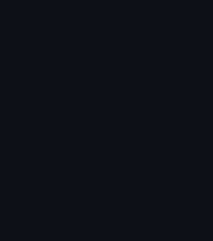

<div align="center">

<h3><code>ram@github ~ $ whoami</code></h3>
<table>
  <tr>
    <td valign="top"></td>
    <td valign="top"></td>
  </tr>
</table>

<h3><code>ram@github ~ $ cat about_me.txt</code></h3>
<p align="center">
  Hey, I'm Ramprakash! 👋 I'm an <b>AI Engineer</b>, <b>Freelancer</b>, and a <b>Vector AI Scholar</b> (1 of 100 in Canada) currently incoming as an <b>MDSAI Co-op at UWaterloo</b>. I am deeply passionate about <b>Artificial Intelligence</b>, community building, and crafting futuristic tech experiences. As a <b>Google & Microsoft Student Ambassador</b>, I love connecting with the community—I even had the honor of meeting <b>Google CEO Sundar Pichai</b>! When I'm not training models, I'm building cool open-source projects.
</p>

<p align="center">
  <a href="https://ramprakashraja.dev" target="_blank"></a>
  <a href="https://www.linkedin.com/in/ramprakashraja" target="_blank"></a>
  <a href="https://www.instagram.com/ramprakash.raja_2004" target="_blank"></a>
  <a href="mailto:ramprakashraja1@gmail.com"></a>
</p>

<h3><code>ram@github ~ $ ./contributions.sh</code></h3>


<br><br>

<h3><code>ram@github ~ $ cat tech_stack.json</code></h3>
<p align="center">
  <a href="https://skillicons.dev">
    
  </a>
</p>

<br><br>

<h3><code>ram@github ~ $ ./play_snake.sh</code></h3>
<picture>
  <source media="(prefers-color-scheme: dark)" srcset="https://raw.githubusercontent.com/RamprakashRP/RamprakashRP/output/snake.svg">
  <source media="(prefers-color-scheme: light)" srcset="https://raw.githubusercontent.com/RamprakashRP/RamprakashRP/output/snake.svg">
  
</picture>

<br><br>

<h2 align="center">"Code. Organize. Inspire. Repeat."</h2>

</div>

<details>
<summary>View Raw Data (For Screen Readers & Crawlers)</summary>

```yaml
# Neofetch Profile Data
User: Ramprakash Raja
Role: AI Engineer
Focus: Community Builder & Freelancer
Scholar: Vector AI Scholar (1 of 100 in Canada)
Incoming: MDSAI Co-op @ UWaterloo
Portfolio: https://ramprakashraja.dev
Community: Google & Microsoft Student Ambassador
Website: ramprakashraja.dev
```

### 🏆 Recognitions & Awards
- **Vector Scholarship in AI** — [Verify Official Award](https://vectorinstitute.ai/research-talent/students/scholarships/)
- **Top 6 Google Ambassador** — Met Google CEO Sundar Pichai
- **UWaterloo Feature** — [Official Announcement](https://www.linkedin.com/posts/faculty-of-math_congratulations-to-the-incoming-data-science-activity-7472634210563055616-OFhe)

</details>
