<div align="center">
  

  <br><br>

  <a href="https://ramprakashraja.dev" target="_blank">
    
  </a>
</div>

<br>

<div align="center">

<h3><code>ram@github ~ $ whoami</code></h3>
<table>
  <tr>
    <td valign="top" width="40%">
      
    </td>
    <td valign="top" width="60%">

```yaml
# Neofetch Profile Data
User       Ramprakash Raja
Role       AI Engineer
Scholar    Vector AI Scholar (1 of 100 in Canada)
Incoming   MDSAI Co-op @ UWaterloo
Community  Google & Microsoft Student Ambassador
Website    ramprakashraja.dev
```

### 🏆 Recognitions & Awards
- **Vector Scholarship in AI** — [Verify Official Award](https://vectorinstitute.ai/research-talent/students/scholarships/)
- **Top 6 Google Ambassador** — Met Google CEO Sundar Pichai
- **UWaterloo Feature** — [Official Announcement](https://www.linkedin.com/posts/faculty-of-math_congratulations-to-the-incoming-data-science-activity-7472634210563055616-OFhe)

<br>

**[👉 Read my full case studies at ramprakashraja.dev](https://ramprakashraja.dev)**

    </td>
  </tr>
</table>

<br><br>

<h3><code>ram@github ~ $ ./contributions.sh</code></h3>


<br><br>

<h3><code>ram@github ~ $ python telemetry.py</code></h3>


<br><br>

<h2 align="center">"Code. Organize. Inspire. Repeat."</h2>

</div>
